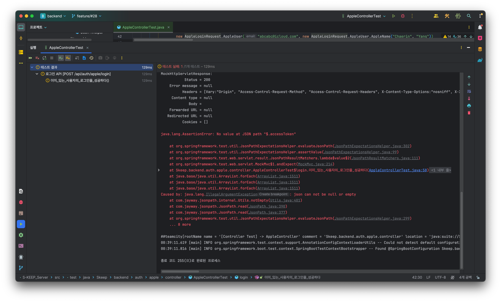

### Response Body가 null인 문제를 해결하기


```java
            BDDMockito
                    .given(appleService.login(ArgumentMatchers.any(AppleLoginRequest.class)))
                    .willReturn(jwtDto);
```

Service Layer에서 토큰을 뱉음에도 불구하고 body가 null인 문제가 발생했다.  
login 메소드에 들어가는 인자를 any로 하여 특정하지 않으면 된다고 여기저기 나와있는데 그렇게 하여도 해결되지 않았다...

```java
    @PostMapping("/login")
    public ResponseEntity<JwtDto> login(@RequestBody AppleLoginRequest request) throws AuthenticationException, NoSuchAlgorithmException, InvalidKeySpecException, JsonProcessingException {
//        JwtDto jwtDto = appleService.login(request);
//        return ResponseEntity.ok(jwtDto);

        return ResponseEntity.ok(new JwtDto("111", "222"));
    }
```
위와 같이 request를 활용하지 않아도 문제가 생기는 것을 보니, request를 AppleLoginRequest에 담을 때 부터 문제가 생기는 것처럼 보인다.

```java
verify(appleService).login(ArgumentMatchers.any());
```
위의 코드로 확인해보니, 다음과 같은 메시지가 출력되었다.

```text
Wanted but not invoked:
Skeep.backend.auth.apple.service.AppleService#0 bean.login(
    <any>
);
-> at Skeep.backend.auth.apple.service.AppleService.login(AppleService.java:33)
Actually, there were zero interactions with this mock.

Wanted but not invoked:
Skeep.backend.auth.apple.service.AppleService#0 bean.login(
    <any>
);
-> at Skeep.backend.auth.apple.service.AppleService.login(AppleService.java:33)
Actually, there were zero interactions with this mock.

	at Skeep.backend.auth.apple.service.AppleService.login(AppleService.java:33)
	at Skeep.backend.auth.apple.controller.AppleControllerTest$login.이미_있는_사용자의_로그인을_성공하다(AppleControllerTest.java:39)
	at java.base/java.lang.reflect.Method.invoke(Method.java:568)
	at java.base/java.util.ArrayList.forEach(ArrayList.java:1511)
	at java.base/java.util.ArrayList.forEach(ArrayList.java:1511)
	at java.base/java.util.ArrayList.forEach(ArrayList.java:1511)
```
> appleService.login 메서드가 실제로 호출되지 않았다는 것을 나타냅니다.